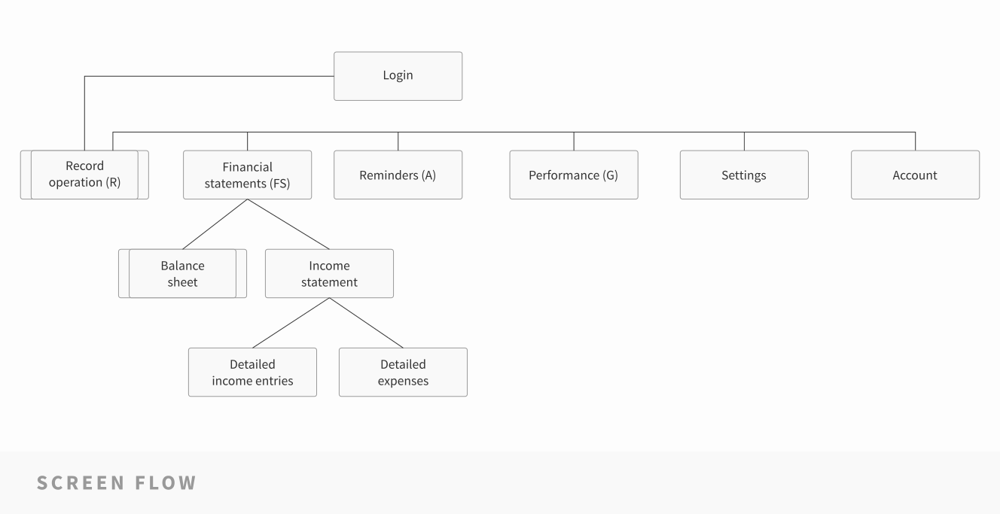
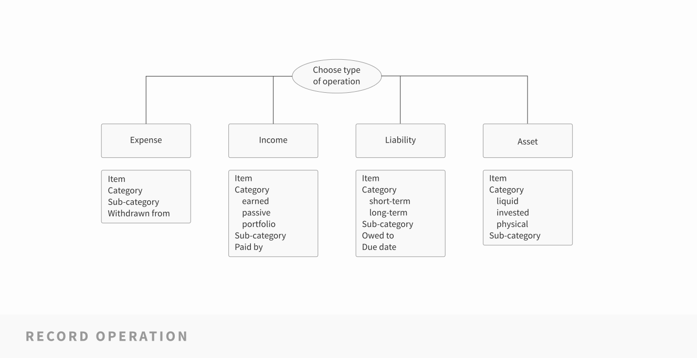

# Architecture

## Screen flow

### Login

Typical login screen.

### Record operation (R)

Welcoming screen because the user will access the app mainly to record some financial operation. This screen consists of a simple form, where the user will chose among these types:
* Income
* Expense
* Liability
* Transaction (between check accounts)

The rest of elements of the form will be displayed according to the type of operation.

### Financial statements (FS)

TBA

### Reminders (A)

Interface for managing reminders, similar to a standard alarm interface.

### Performance (G)

Display of financial ratios and statistics. This will be the UI for the Goals section.

### Settings

Mainly used to set up categories, sub-categories and defaults for pre-populated elements.

### Account

Settingns regarding the user profile and log-out option.

### Balance sheet

Regular balance sheet + UI to add assets and manage their set up (specify type of accounts, add or delete assets, etc.).

### Income statement

TBA

### Detailed income entries

Income entries clasified according to income categories (based on literature on finances) and according to subcategories defined by the user (in case that they define them).

### Detailed expenses

Expenses clasified according to the categories that the user has set up.